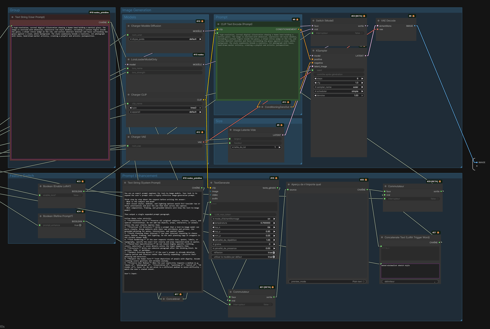

# ComfyUI-LinkSpotlight


Press **Alt+H** and instantly see only the links that matter: LinkSpotlight
hides (or dims) every connection that doesn't touch the selected node, turning
a spaghetti workflow into a readable one while you edit.



## Features

- **One shortcut, on demand** — Alt+H toggles the spotlight; press again to
  restore everything. Fully remappable in *Settings → Keybinding* (command
  `LinkSpotlight.Toggle`), also available from the command palette.
- **Follows your selection live** — click another node and the spotlight moves
  with it, no re-toggle needed. Multi-selection is supported (union of links).
- **Hide or dim** — out-of-focus links can be fully hidden (default) or dimmed
  to a configurable opacity so the rest of the graph stays faintly readable.
- **Depth control** — keep only the selected node's links (default), or also
  every link of its direct neighbors.
- **Optional node dimming** — fade unrelated nodes too, for maximum focus.
- **Auto-off** — clearing the selection exits the spotlight automatically
  (configurable).
- **Zero overhead when off** — a single boolean check per draw call; the
  settings store is never queried in the render hot path.
- **Non-destructive** — nothing in the workflow is mutated; no state can leak
  into the serialized JSON. Reroutes, floating links and subgraphs are handled.

## Installation

### ComfyUI Manager (recommended)

Search for **LinkSpotlight** in ComfyUI-Manager and install, then restart.

### Manual

```bash
cd ComfyUI/custom_nodes
git clone https://github.com/Ding-sl/ComfyUI-LinkSpotlight
```

Restart ComfyUI (or reload the browser page). No Python dependencies — this
package is frontend-only and ships zero nodes.

## Usage

1. Select one or more nodes.
2. Press **Alt+H** — only their links stay visible.
3. Click other nodes to move the spotlight, press **Alt+H** again (or clear
   the selection) to exit.

Pressing Alt+H with nothing selected shows a hint toast and does nothing.

> **Want plain `H` instead?** The single key is bound to `Comfy.Canvas.Lock`
> by core. Unbind that first in *Settings → Keybinding*, then assign `H` to
> *Toggle Link Spotlight*.

## Settings

All settings live under **Settings → LinkSpotlight** and apply live while the
spotlight is active.

| Setting | Default | Description |
| ------- | ------- | ----------- |
| Opacity of out-of-focus links | `0` | `0` hides them completely; `~0.07` keeps them faintly visible |
| Spotlight depth | `1` | `1` = selected node's links only; `2` = neighbors' links too |
| Turn off when the selection is cleared | `on` | Auto-exit on deselect; when off, an empty selection renders the graph normally |
| Opacity of out-of-focus nodes | `1` | Lower it to dim unrelated nodes as well |

## How it works

LinkSpotlight wraps the canvas link-rendering path (`drawConnections` /
`_renderAllLinkSegments`) with non-destructive filters: the focus set is
recomputed once per frame from the current selection, and each link is drawn,
dimmed or skipped individually. Alpha changes are multiplicative and restored
in `finally` blocks, so they compose safely with ComfyUI's own rendering
(execution flashes, bypass dimming, etc.).

These are internal frontend APIs. If a ComfyUI update renames them, the
extension **disables itself cleanly** with a console error instead of breaking
the canvas — worst case you lose the spotlight until an update here.

## Compatibility

- Developed and tested against `comfyui-frontend-package` **1.45.x**
  (ComfyUI v0.28). Should work on any recent 1.4x frontend.
- **Vue nodes beta ("Nodes 2.0"): supported** — the link spotlight works the
  same there. Only the optional *node dimming* setting has no effect in that
  mode: Vue nodes are DOM-rendered, not canvas-drawn.
- Coexists with the core *Link Render Mode* setting (including "Hidden") and
  with link-drawing extensions — wrappers chain instead of replacing.

## Related projects

- [ComfyUI-SelectionFocus](https://github.com/comfyui-wiki/ComfyUI-SelectionFocus)
  — always-on variant: automatically dims unrelated links whenever a node is
  selected. LinkSpotlight takes the opposite approach: an explicit, remappable
  shortcut you hit when you need focus, plus depth control, node dimming and
  a zero-cost idle path. Pick whichever matches your workflow.
- [ComfyUI-LinkRouter](https://github.com/90-RED/ComfyUI-LinkRouter) — smart
  orthogonal link routing with hover highlight.
- Core *Link Render Mode → Hidden* — hides **all** links globally.

## Support

If this extension saves you from noodle blindness, a ⭐ on the repo helps a
lot — and you can support development on
[Patreon](https://www.patreon.com/Dingsl) ☕. Everything stays free and
open source for everyone. Issues and PRs welcome.

## License

[MIT](LICENSE)
